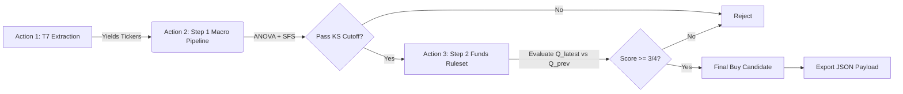

# Xetra Two-Step Stock Prediction

**Stock Batch Analysis Dashboard:** [](https://kleinnconrad.github.io/stock-predictor/)

## Table of Contents
- [How the Engine Works: The Two-Step Cascade](#how-the-engine-works-the-two-step-cascade)
- [Architecture Diagram](#architecture-diagram)
- [The 360-Degree Data Universe](#the-360-degree-data-universe)
- [Execution Guide](#execution-guide)
- [Directory Structure](#directory-structure)
- [Outputs & Diagnostics](#outputs--diagnostics)

A modular, distributed machine learning pipeline designed to predict German Xetra (`.DE`) stock price movements over a 6-month (126 trading day) horizon. The system utilizes a 360-degree global macroeconomic universe coupled with target company fundamentals, passing data through a Two-Step Cascade using Kolmogorov-Smirnov (KS) optimized Logistic Regression models.

## How the Engine Works: The Two-Step Cascade

To improve computational efficiency, logically mimic human institutional investing, and bypass API rate limits, the model evaluates stocks across three distributed GitHub Actions:

1. **Action 1 (T7 Initialization & Qualification):** Extracts the universe of ~5,000 Xetra instruments directly from the Deutsche Börse network. It applies deterministic Pandas filters (`Instrument Type == 'CS'` and `Product Assignment Group Description == 'DEUTSCHLAND'`) to strip out ETFs, ETNs, warrants, and foreign listings. This narrows the dataset down to the ~250 relevant, domestic German equities, reducing compute requirements without relying on external LLM APIs.
2. **Action 2 (Step 1 - Macro & Market Environment):** 
   The system assesses whether the *global economic climate* and the stock's *specific price momentum* are conducive to a +15% gain over the next 6 months. If the Logistic Regression pipeline predicts "UP" for the most recent unobservable date (and its probability clears the dynamically calculated KS cutoff), the stock is passed to Step 2 via GitHub Artifacts.
3. **Action 3 (Step 2 - Company Fundamentals):** 
   If Step 1 flags the stock's current environment as "UP", the system evaluates the target company's latest quarterly financial health (Income Statements, Balance Sheets, Cash Flows) using a **Deterministic Rules Engine**. If the stock passes at least 3 out of 4 fundamental health rules, it is flagged as a Buy Candidate.

### The Hybrid Pipeline (Machine Learning + Rules Engine)
The engine separates macro momentum prediction (Step 1) from fundamental accounting validation (Step 2):

**Step 1 (Macro Momentum) utilizes a Scikit-Learn architecture:**
* **Forward-Fill Imputation (`ffill`)**: Raw macro data is strictly forward-filled upon ingestion.
* **Median Imputation**: `SimpleImputer(strategy='median')` handles extreme edge-case NaNs.
* **Z-Scaling (`StandardScaler`)**: Normalizes the data into standard deviations inside the pipeline.
* **ANOVA Pre-filter (`SelectKBest`)**: Slices the universe down to the statistically significant features.
* **Sequential Feature Selection (SFS)**: Iteratively selects 12 independent variables.
* **KS-Optimized Logistic Regression**: Outputs probabilities, converted to binary 0s and 1s by dynamically calculating the threshold that maximizes the Kolmogorov-Smirnov (KS) statistic.
* **Cross-Validation Accuracy Safeguard**: Before making a final prediction, the model performs a 3-Fold Cross-Validation on the historical dataset. The ticker must achieve a minimum **CV Accuracy of 65%** `(True Positives + True Negatives) / Total Observations` to proceed. If the algorithm cannot accurately model the historical patterns above this threshold, it rejects the ticker as "NOT_UP" regardless of the current day's prediction.

### Step 2: The 10-Point Fundamental Ruleset Engine
Because historical fundamental data is often too sparse for robust machine learning, Step 2 bypasses ML entirely. Instead, it acts as a strict, deterministic financial auditor. It compares the company's **most recent quarterly financial statement (Latest)** against the **immediately preceding quarter (Prev)** across 10 rigorous institutional value-investing rules.

**A minimum score of 7 out of 10 is strictly required to pass.**

| # | Rule Name | Formula / Logic | Financial Rationale |
|---|---|---|---|
| 1 | **Revenue Growth** | `Total Revenue (Latest) > Total Revenue (Prev)` | Ensures the company is actually growing its top-line sales. |
| 2 | **Profitability** | `Net Income (Latest) > 0` | The company must be currently profitable. Speculative, cash-burning companies are rejected. |
| 3 | **Earnings Momentum** | `Net Income (Latest) > Net Income (Prev)` | Bottom-line profits must be expanding quarter-over-quarter. |
| 4 | **Cash Flow Health** | `Operating Cash Flow (Latest) > 0` | The core day-to-day business operations must be generating positive cash. |
| 5 | **Quality of Earnings** | `Operating Cash Flow (Latest) > Net Income (Latest)` | A classic forensic accounting check. If paper profits exceed actual cash generated, earnings may be artificially inflated by accruals. |
| 6 | **Free Cash Flow** | `Free Cash Flow (Latest) > 0` | Ensures the company generates surplus cash *after* maintaining its capital assets (CapEx), available for dividends or growth. |
| 7 | **Margin Improvement** | `Operating Margin (Latest) > Operating Margin (Prev)` | Measures efficiency. Revenue growth is only valuable if the cost to generate it isn't rising even faster. |
| 8 | **Liquidity** | `Current Assets / Current Liabilities > 1.2` | The Current Ratio. Ensures the company can cover short-term obligations and survive an economic shock. |
| 9 | **De-leveraging** | `Total Debt (Latest) < Total Debt (Prev)` | Rewards companies that are actively paying down their principal debt load rather than accumulating leverage. |
| 10 | **ROE Proxy** | `Net Income / Stockholders Equity > 0.03` | Measures capital efficiency. Ensures management is generating at least a ~12% annualized return on shareholder equity. |

---

## Architecture Diagram



---

## The 360-Degree Data Universe

To prevent Yahoo Finance IP bans, the entire Macro universe is pre-fetched and cached in memory *once* before the ticker loop begins. Raw asset prices are mathematically transformed into a matrix of stationary quantitative features before being injected into the models.

### Quantitative Feature Engineering (Macro Expansion)
To capture non-linear market dynamics, the global macro universe (~80 variables) is computationally expanded into a matrix of **~400+ stationary features** before entering the ANOVA pre-filter. This expansion is powered by the following mathematical transformations:
* **Interaction Ratios**: Calculates systemic economic cross-currents like Copper/Gold (`HG=F / GC=F`), Tech/Market Dominance (`XLK / SPY`), and High Yield Credit Spreads (`HYG / LQD`).
* **Multi-Timeframe Momentum**: Extracts 1-month (21D), 1-quarter (63D), 6-month (126D), and 1-year (252D) momentums. It dynamically applies percentage change (`pct_change`) for standard indices and absolute differencing (`diff`) for natively stationary rates.
* **Distance to Trend**: Measures mean-reversion setups by calculating the normalized distance between the current asset value and its 200-day Simple Moving Average (SMA).
* **Macro Acceleration (2nd Derivative)**: Determines if slow-moving economic data (e.g., CPI, Nonfarm Payrolls) is accelerating or decelerating by comparing current Year-over-Year changes against YoY changes from 3 months prior.
* **Regime Normalization**: Runs a 2-year (504-day) rolling Z-Score on stress indicators (VIX, Economic Policy Uncertainty, Credit Spreads) to detect when systemic fear is statistically elevated beyond the baseline of the current market regime.

### Step 1 Base Variables (Market Momentum & Global Macro)
During Step 1, the target stock's technical momentums (21D, 63D, 126D, 252D) are joined with the engineered derivatives of over 80 global economic indices fetched from Yahoo Finance and the St. Louis Fed (FRED).

* **Target Technicals (Yahoo Finance):** `Ret_21D`, `Ret_63D`, `Ret_126D`, `Ret_252D`, `Dist_SMA_50`, `Dist_SMA_200`, `Vol_21D`.
* **Interest Rates & Yield Curves (FRED/YF):** US 10Y Yield, 13-Week T-Bill, `T10Y2Y` (10Y-2Y Spread).
* **Credit Risk (YF):** High Yield Corp Bonds (`HYG`), Inv Grade Bonds (`LQD`), 20+ Year Treasuries (`TLT`), Sovereign Yields (`IGOV`, `BWX`, `BNDX`).
* **Volatility & FX (YF):** `VIX`, US Dollar Index, `EURUSD=X`, `JPY=X`.
* **Commodities (YF):** Crude Oil, Gold, Copper, Corn, Wheat, Live Cattle, Lumber.
* **Sectors & Factor Indices (YF):** Tech, Financials, Energy, Real Estate, Emerging Markets, Utilities, Consumer Staples, Consumer Discretionary, Healthcare, Small Caps (`IWM`), Transports (`IYT`), S&P Equal Weight (`RSP`), Semiconductors (`SMH`), DAX, Nikkei 225.
* **Alternative Liquidity (YF):** Bitcoin (`BTC-USD`).
* **Global Economic Data (FRED):** US CPI, US Nonfarm Payrolls, Fed Total Assets, EU CPI, EU Unemployment, ECB Assets, EU Industrial Production, Japan CPI, BOJ Assets, UK CPI.
* **Leading Indicators & Stress (FRED):** US Policy Uncertainty Index, Global Policy Uncertainty, Chicago Fed Financial Conditions Index (`NFCI`), M2 Money Supply, Building Permits, Initial Claims, Consumer Sentiment, Durable Goods Orders.

### Step 2 Variables (Company Fundamentals)
If a stock reaches Step 2, its quarterly financial statements are fetched from Yahoo Finance and filtered against a predefined `FUNDAMENTAL_UNIVERSE` to ensure only accounting rows enter the model.

* **Income Statement:** Total Revenue, Operating Revenue, Gross Profit, Operating Income, EBIT, EBITDA, Net Income, Net Income Common Stockholders, Basic EPS, Diluted EPS.
* **Balance Sheet:** Total Assets, Current Assets, Total Liabilities (Net Minority Interest), Current Liabilities, Total Debt, Net Debt, Cash And Cash Equivalents, Stockholders Equity, Working Capital, Retained Earnings.
* **Cash Flow:** Operating Cash Flow, Investing Cash Flow, Financing Cash Flow, Free Cash Flow, Capital Expenditure, Repayment Of Debt, Issuance Of Debt.

---

## Execution Guide

The engine can be executed either directly from your local terminal or distributed in the cloud via GitHub Actions.

### 1. Local Terminal Execution
The `main.py` entry point acts as your local CLI.

* **Single-Ticker Mode (Diagnosis):**
  If you want to diagnose a specific stock without waiting for the entire Xetra universe to process:
  ```bash
  python main.py --ticker SAP.DE
  ```
* **Full Batch Mode:**
  If you want to evaluate the entire German retail market sequentially on your local machine:
  ```bash
  python main.py
  ```

### 2. Cloud Execution (GitHub Actions)
For execution and bypass of API rate limits, you can manually trigger the decoupled Actions via the "Actions" tab on GitHub. **You must run them in this exact order**, as they pass state and payloads to each other via GitHub Artifacts:

1. **`1. T7 Download (Initialization)`**: Fetches the master list of qualified `.DE` tickers.
2. **`2. Execute Pipeline (Step 1 & 2)`**: Automatically spawns 3 parallel runners. Evaluates global macro conditions for all tickers, merges surviving tickers, and evaluates company balance sheets.

### ⚠️ CRITICAL WARNING: The Intraday Data Glitch
Because GitHub Actions run in the UTC timezone, triggering a Cloud Batch run while the European or US markets are still actively trading can result in severe data desynchronization. `yfinance` fetches historical data up to `datetime.date.today()`, which means the cloud runner might fetch data that ends on *yesterday's* trading candle, while a local run in your timezone fetches up to the *live* trading candle. 

This 1-day data offset can cause massive momentum metric shifts (`Dist_SMA_200`, multi-timeframe returns), violently swinging a stock's prediction probability from a solid Buy down to a Reject within the exact same hour.

> [!WARNING]
> **Always double-check dashboard candidates!** Before executing any real trades based on an `UP_FINAL_BUY` candidate displayed on the cloud dashboard, you **must** manually run `python main.py --ticker <TICKER>` on your local machine to verify the prediction using fully propagated, localized market data.

---

## Directory Structure

Here is the directory layout of the repository and what you can find in each folder:

- **`.github/`**: Contains the GitHub Actions workflows for running the decoupled ML pipeline in the cloud.
- **`config/`**: Configuration files and parameters (e.g., `settings.yaml`) used by the models.
- **`dashboard/`**: A frontend web application containing the HTML/JS/CSS for a glassmorphic data visualization dashboard deployed to GitHub Pages.
- **`data/`**: Stores data artifacts at various stages of processing:
  - `data/raw/`: Raw datasets downloaded from APIs or data providers.
  - `data/state/`: Intermediate state artifacts passed between pipeline steps.
  - `data/processed/`: Final aggregated outputs (like `final_buy_signals.csv` and `full_batch_report.json`).
- **`devcontainer/`**: Devcontainer configuration to spin up isolated, reproducible development environments.
- **`docs/`**: Documentation files, such as SQL logic reference files for feature engineering.
- **`logs/`**: Local log files generated during system execution for debugging.
- **`outputs/`**: System output payloads for evaluated stocks:
  - `outputs/diagnostics/`: Feature survival tracking and ANOVA filtering diagnostics.
  - `outputs/predictions/`: Full model state payloads including optimized KS cutoffs, weights, and final predictions.
- **`scripts/`**: Entry point scripts specifically designed to be executed by GitHub Actions runners.
- **`src/`**: The core application logic:
  - `src/ingestion/`: API connectors (Yahoo Finance, FRED, etc.) and macroeconomic dataset pre-fetching.
  - `src/modeling/`: The Step 1 (Macro Momentum) and Step 2 (Company Fundamentals) evaluators.
  - `src/processing/`: Feature engineering, variable expansion, and data manipulation.
  - `src/orchestration/`: Utilities for exporting JSON payloads and system coordination.

---

## Outputs & Diagnostics

The engine generates outputs for every stock evaluated:
1. **`outputs/predictions/{ticker}_prediction.json`**: Contains the full payload, including the specific 12 features selected per step, their exact standardized logistic regression weights, accuracy scores, optimized KS cutoffs, and the final predicted class.
2. **`outputs/diagnostics/{ticker}_feature_diagnostics.json`**: An analytical file documenting exactly which columns were fetched for a stock, which were killed by the ANOVA pre-filter, and which survived ANOVA but were killed by the Sequential Feature Selector.
3. **`data/processed/final_buy_signals.csv`**: An aggregated list of tickers that survived both Step 1 and Step 2 and are marked as "UP" for the upcoming 6-month horizon.
