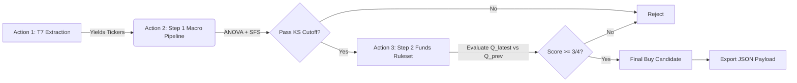

# Xetra Two-Step Stock Prediction

A highly modular, distributed machine learning pipeline designed to predict German Xetra (`.DE`) stock price movements over a 6-month (126 trading day) horizon. The system utilizes a massive 360-degree global macroeconomic universe coupled with target company fundamentals, passing data through a strict **Two-Step Cascade** using Kolmogorov-Smirnov (KS) optimized Logistic Regression models.

## How the Engine Works: The Two-Step Cascade

To maximize computational efficiency, logically mimic human institutional investing, and bypass API rate limits, the model evaluates stocks across three distributed GitHub Actions:

1. **Action 1 (T7 Initialization):** Extracts the universe of qualified Xetra retail tickers directly from the Deutsche Börse network.
2. **Action 2 (Step 1 - Macro & Market Environment):** 
   The system assesses whether the *global economic climate* and the stock's *specific price momentum* are conducive to a +15% gain over the next 6 months. If the Logistic Regression pipeline predicts "UP" for the most recent unobservable date (and its probability clears the dynamically calculated KS cutoff), the stock is passed to Step 2 via GitHub Artifacts.
3. **Action 3 (Step 2 - Company Fundamentals):** 
   If Step 1 flags the stock's current environment as "UP", the system evaluates the target company's latest quarterly financial health (Income Statements, Balance Sheets, Cash Flows) using a **Deterministic Rules Engine**. If the stock passes at least 3 out of 4 strict fundamental health rules, it is officially flagged as a Buy Candidate.

### The Hybrid Pipeline (Machine Learning + Rules Engine)
The engine separates macro momentum prediction (Step 1) from fundamental accounting validation (Step 2):

**Step 1 (Macro Momentum) utilizes a strict Scikit-Learn architecture:**
* **Forward-Fill Imputation (`ffill`)**: Raw macro data is strictly forward-filled upon ingestion.
* **Median Imputation**: `SimpleImputer(strategy='median')` handles extreme edge-case NaNs.
* **Z-Scaling (`StandardScaler`)**: Normalizes the data into standard deviations inside the pipeline.
* **ANOVA Pre-filter (`SelectKBest`)**: Slices the universe down to the top statistically significant features.
* **Sequential Feature Selection (SFS)**: Iteratively selects the absolute best **12** independent variables.
* **KS-Optimized Logistic Regression**: Outputs probabilities, converted to binary 0s and 1s by dynamically calculating the threshold that maximizes the Kolmogorov-Smirnov (KS) statistic.

**Step 2 (Company Fundamentals) utilizes a Deterministic Ruleset Engine:**
Because historical fundamental data is sparse, Step 2 bypasses ML and evaluates the raw Q/Q changes on the last 2 financial statements against 4 hard rules (Revenue Growth, Profitability, Earnings Momentum, Cash Flow Health). A score of 3/4 is required to pass.

---

## Architecture Diagram



---

## The 360-Degree Data Universe

To prevent Yahoo Finance IP bans, the entire Macro universe is pre-fetched and cached in memory *once* before the ticker loop begins. Raw asset prices are mathematically transformed into a massive matrix of stationary quantitative features before being injected into the models.

### Quantitative Feature Engineering (Macro Expansion)
To capture non-linear market dynamics, the raw global macro universe (~80 variables) is computationally expanded into a matrix of **~400+ highly predictive, stationary features** before entering the ANOVA pre-filter. This expansion is powered by the following mathematical transformations:
* **Interaction Ratios**: Calculates systemic economic cross-currents like Copper/Gold (`HG=F / GC=F`), Tech/Market Dominance (`XLK / SPY`), and High Yield Credit Spreads (`HYG / LQD`).
* **Multi-Timeframe Momentum**: Extracts 1-month (21D), 1-quarter (63D), 6-month (126D), and 1-year (252D) momentums. It dynamically applies percentage change (`pct_change`) for standard indices and absolute differencing (`diff`) for natively stationary rates.
* **Distance to Trend**: Measures mean-reversion setups by calculating the normalized distance between the current asset value and its 200-day Simple Moving Average (SMA).
* **Macro Acceleration (2nd Derivative)**: Determines if slow-moving economic data (e.g., CPI, Nonfarm Payrolls) is accelerating or decelerating by comparing current Year-over-Year changes against YoY changes from 3 months prior.
* **Regime Normalization**: Runs a 2-year (504-day) rolling Z-Score on stress indicators (VIX, Economic Policy Uncertainty, Credit Spreads) to detect when systemic fear is statistically elevated beyond the baseline of the current market regime.

### Step 1 Base Variables (Market Momentum & Global Macro)
During Step 1, the target stock's technical momentums (21D, 63D, 126D, 252D) are joined with the heavily engineered derivatives of over 80 global economic indices fetched from Yahoo Finance and the St. Louis Fed (FRED).

* **Target Technicals (Yahoo Finance):** `Ret_21D`, `Ret_63D`, `Ret_126D`, `Ret_252D`, `Dist_SMA_50`, `Dist_SMA_200`, `Vol_21D`.
* **Interest Rates & Yield Curves (FRED/YF):** US 10Y Yield, 13-Week T-Bill, `T10Y2Y` (10Y-2Y Spread).
* **Credit Risk (YF):** High Yield Corp Bonds (`HYG`), Inv Grade Bonds (`LQD`), 20+ Year Treasuries (`TLT`), Sovereign Yields (`IGOV`, `BWX`, `BNDX`).
* **Volatility & FX (YF):** `VIX`, US Dollar Index, `EURUSD=X`, `JPY=X`.
* **Commodities (YF):** Crude Oil, Gold, Copper, Corn, Wheat, Live Cattle, Lumber.
* **Sectors & Factor Indices (YF):** Tech, Financials, Energy, Real Estate, Emerging Markets, Utilities, Consumer Staples, Consumer Discretionary, Healthcare, Small Caps (`IWM`), Transports (`IYT`), S&P Equal Weight (`RSP`), Semiconductors (`SMH`), DAX, Nikkei 225.
* **Alternative Liquidity (YF):** Bitcoin (`BTC-USD`).
* **Global Economic Data (FRED):** US CPI, US Nonfarm Payrolls, Fed Total Assets, EU CPI, EU Unemployment, ECB Assets, EU Industrial Production, Japan CPI, BOJ Assets, UK CPI.
* **Leading Indicators & Stress (FRED):** US Policy Uncertainty Index, Global Policy Uncertainty, Chicago Fed Financial Conditions Index (`NFCI`), M2 Money Supply, Building Permits, Initial Claims, Consumer Sentiment, Durable Goods Orders.

### Step 2 Variables (Company Fundamentals)
If a stock reaches Step 2, its quarterly financial statements are fetched from Yahoo Finance and strictly filtered against a predefined `FUNDAMENTAL_UNIVERSE` to ensure only dense, highly-predictive accounting rows enter the model.

* **Income Statement:** Total Revenue, Operating Revenue, Gross Profit, Operating Income, EBIT, EBITDA, Net Income, Net Income Common Stockholders, Basic EPS, Diluted EPS.
* **Balance Sheet:** Total Assets, Current Assets, Total Liabilities (Net Minority Interest), Current Liabilities, Total Debt, Net Debt, Cash And Cash Equivalents, Stockholders Equity, Working Capital, Retained Earnings.
* **Cash Flow:** Operating Cash Flow, Investing Cash Flow, Financing Cash Flow, Free Cash Flow, Capital Expenditure, Repayment Of Debt, Issuance Of Debt.

---

## Execution Guide

The engine is highly flexible and can be executed either directly from your local terminal or fully distributed in the cloud via GitHub Actions.

### 1. Local Terminal Execution
The `main.py` entry point acts as your local CLI.

* **Single-Ticker Mode (Fast Diagnosis):**
  If you want to instantly diagnose a specific stock without waiting for the entire Xetra universe to process:
  ```bash
  python main.py --ticker SAP.DE
  ```
* **Full Batch Mode:**
  If you want to evaluate the entire German retail market sequentially on your local machine:
  ```bash
  python main.py
  ```

### 2. Cloud Execution (GitHub Actions)
For maximum speed and bypass of API rate limits, you can manually trigger the decoupled Actions via the "Actions" tab on GitHub. **You must run them in this exact order**, as they pass state and payloads to each other via GitHub Artifacts:

1. **`1. T7 Download (Initialization)`**: Fetches the master list of qualified `.DE` tickers.
2. **`2. Execute Step 1 (Macro)`**: Automatically spawns 3 parallel runners. Evaluates global macro conditions for all tickers.
3. **`3. Execute Step 2 (Fundamentals)`**: Automatically spawns 3 parallel runners. Merges the surviving tickers from Step 1 and evaluates company balance sheets.

---

## Outputs & Diagnostics

The engine generates highly granular outputs for every stock evaluated:
1. **`outputs/predictions/{ticker}_prediction.json`**: Contains the full payload, including the specific 12 features selected per step, their exact standardized logistic regression weights, accuracy scores, optimized KS cutoffs, and the final predicted class.
2. **`outputs/diagnostics/{ticker}_feature_diagnostics.json`**: An analytical file documenting exactly which columns were fetched for a stock, which were killed by the ANOVA pre-filter, and which survived ANOVA but were killed by the Sequential Feature Selector.
3. **`data/processed/final_buy_signals.csv`**: An aggregated list of tickers that survived both Step 1 and Step 2 and are marked as "UP" for the upcoming 6-month horizon.
