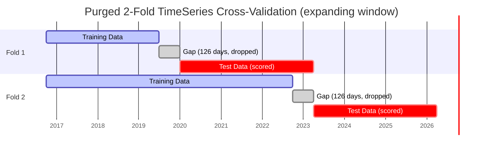
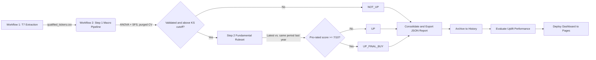

# Xetra Two-Step Stock Prediction
[](https://github.com/kleinnconrad/stock-predictor/actions/workflows/01_t7_download.yml)
[](https://github.com/kleinnconrad/stock-predictor/actions/workflows/02_run_pipeline.yml)
[](https://github.com/kleinnconrad/stock-predictor/actions/workflows/ci.yml)

## Table of Contents
- [How the Engine Works](#how-the-engine-works)
- [Architecture Diagram](#architecture-diagram)
- [The variable set](#the-variable-set)
- [Execution Guide](#execution-guide)
- [Configuration](#configuration)
- [Testing](#testing)
- [Dependency Management](#dependency-management)
- [Release Management](#release-management)
- [Directory Structure](#directory-structure)
- [Outputs & Diagnostics](#outputs--diagnostics)

A modular, distributed machine learning pipeline designed to predict German Xetra (`.DE`) stock price movements over a 6-month (126 trading day) horizon. The system combines a global macroeconomic universe with target company fundamentals, passing data through a Two-Step Cascade: a Kolmogorov-Smirnov (KS) optimized Logistic Regression model (Step 1) followed by a deterministic fundamental ruleset (Step 2).

> **Portfolio Hedging:** If you are looking for a way to hedge the portfolio generated by this engine, check out the companion repository: [](https://github.com/kleinnconrad/depot-hedging-strategist)

## How the Engine Works

The pipeline runs as scheduled GitHub Actions workflows:

1. **`1. T7 Download (Initialization)`** (weekly, Sundays 22:00 UTC): Downloads the list of all tradable Xetra instruments from Deutsche Börse and keeps common stocks (`Instrument Type == 'CS'`) whose `Product Assignment Group Description` is `DEUTSCHLAND`, `DAX`, `MDAX` or `SDAX`. This removes ETFs, ETNs, warrants and foreign listings and leaves roughly 400 domestic equities. No liquidity filter is applied. The list is committed to `data/state/qualified_tickers.csv`.
2. **`2. Execute Pipeline (Step 1 & 2)`** (daily, 01:00 UTC): Splits the ticker list across three parallel runners.
   - **Step 1 (Macro & Market Environment):** Assesses whether the global economic climate and the stock's own price momentum are conducive to a gain of at least 10% within the next 126 trading days. A stock passes if its model validates out of sample and the latest predicted probability clears the KS cutoff.
   - **Step 2 (Company Fundamentals):** Stocks that passed Step 1 are checked against a deterministic ruleset on their latest financial statements. Passing stocks become buy candidates (`UP_FINAL_BUY`).
   - **Consolidation:** Merges the shard outputs into the batch report, archives it, evaluates the uplift of earlier predictions and commits the results.
3. **`Deploy Dashboard to GitHub Pages`**: Publishes the dashboard after every successful pipeline run.

### Step 1: Macro Momentum Model (Machine Learning)
**Scikit-Learn pipeline:**
* **Forward-Fill Imputation (`ffill`)**: All macro series are forward-filled across their observation dates before being aligned to business days, so weekly or monthly values are carried forward correctly.
* **Median Imputation**: `SimpleImputer(strategy='median')` fills the remaining gaps. Features without any observation in a training window are kept as constants and removed by the next step.
* **Variance Threshold**: Drops constant features.
* **Z-Scaling (`StandardScaler`)**: Normalizes the data into standard deviations inside the pipeline.
* **ANOVA Pre-filter (`SelectKBest`)**: Keeps the 40 features (`anova_k`) with the highest F-score.
* **Sequential Feature Selection (SFS)**: Selects 12 features (`features_to_select`) with a TimeSeriesSplit. Its folds are purged (see below) wherever the fold sizes allow it; `sfs_cv_purged` in the output records whether that was possible.
* **Class-Balanced Logistic Regression**: Outputs probabilities, converted to UP / NOT_UP with the cutoff that maximizes the Kolmogorov-Smirnov (KS) statistic.

**Training data:** 10 years of daily history (`step1_history_years`) plus 2 years of warm-up (`feature_warmup_years`), so that the longest rolling features (up to 504 days) are populated from the first training day.

**Validation (purged):**
* The target of each day is the return over the following 126 trading days, so labels of consecutive days overlap. The model is validated with an expanding-window **2-fold TimeSeriesSplit** (`cv_splits`) whose training and test windows are separated by a **gap of 126 rows**. Without that gap, the last training labels would be computed from prices inside the test window.
* Every model is classified with the **KS cutoff learned on its own training rows**: each fold model classifies its test fold with the cutoff from its training data, and the live prediction uses the cutoff of the final model trained on all rows. Refitted logistic regressions put their probabilities on very different scales, so a cutoff is only meaningful for the model it was computed on; it is never transferred between models, and no test data is used to choose it. The reported **CV accuracy** and **confusion matrix** cover both test folds; `cv_fold_cutoffs` lists the cutoff of each fold model.
* A stock passes Step 1 only if the CV accuracy `(TP + TN) / Total` is at least **65%** (`min_cv_accuracy`), the **confusion matrix rule** `TP > FN AND TN > FP` holds, and the latest predicted probability is at or above the KS cutoff.
* A stock that cannot be validated is rejected as NOT_UP with a `cv_status` instead of a score:

| `cv_status` | Meaning |
|---|---|
| `ok` | Validated; the gates above decide the prediction. |
| `insufficient_history` | Too little history for a purged split (first training fold below `min_cv_train_rows`). With the defaults, listings younger than roughly 3.3 years are rejected. |
| `single_class_target` | The stock never (or always) reached the +10% target in its training history. |
| `cv_failed: <reason>` | A training fold contains a single class or the fit failed. |
| `degenerate_cutoff` | A model's predictions on its own training rows have no discriminatory power (KS not positive or no finite cutoff). |

#### Purged TimeSeriesSplit Diagram


```mermaid
gantt
    title Purged 2-Fold TimeSeries Cross-Validation (expanding window)
    dateFormat  YYYY-MM-DD
    axisFormat  %Y

    section Fold 1
    Training Data             :active, 2016-10-01, 2019-07-01
    Gap (126 days, dropped)   :done,   2019-07-01, 2020-01-01
    Test Data (scored)        :crit,   2020-01-01, 2023-04-01

    section Fold 2
    Training Data             :active, 2016-10-01, 2022-10-01
    Gap (126 days, dropped)   :done,   2022-10-01, 2023-04-01
    Test Data (scored)        :crit,   2023-04-01, 2026-04-01
```
*(The training window expands, every test window lies strictly in the future of its training window, and the 126-day gap prevents overlapping labels. Each fold model classifies its test fold with the KS cutoff from its own training data.)*

### Step 2: The Fundamental Ruleset Engine
Because historical fundamental data from Yahoo Finance is sparse, Step 2 does not use machine learning. It compares the company's **latest financial statement** with the statement for the **same period one year earlier** (365 ± 45 days, `step2_yoy_tolerance_days`), which removes seasonality and works for quarterly and half-yearly reporters alike. If no such statement exists, it falls back to the previous statement; `Comparison Basis` in the diagnostics records which was used.

**Scoring:** A rule whose inputs the company does not report (e.g. current assets and operating cash flow for banks and insurers) is *not applicable* and skipped. A company is evaluable if at least **5 rules** are applicable (`min_step2_applicable_rules`). It passes if it meets **7 out of 10** (`min_step2_score`), pro-rated to the applicable rules and rounded up: 7 of 10, 6 of 8, 4 of 5.

| # | Rule Name | Formula / Logic | Financial Rationale |
|---|---|---|---|
| 1 | **Revenue Growth** | `Total Revenue (Latest) > Total Revenue (Comparison)` | Ensures the company is actually growing its top-line sales. |
| 2 | **Profitability** | `Net Income (Latest) > 0` | The company must be currently profitable. |
| 3 | **Earnings Momentum** | `Net Income (Latest) > Net Income (Comparison)` | Bottom-line profits must be expanding. |
| 4 | **Cash Flow Health** | `Operating Cash Flow (Latest) > 0` | The core business operations must be generating positive cash. |
| 5 | **Quality of Earnings** | `Operating Cash Flow (Latest) > Net Income (Latest)` | A forensic accounting check. If paper profits exceed actual cash generated, earnings may be inflated by accruals. |
| 6 | **Free Cash Flow** | `Free Cash Flow (Latest) > 0` | The company generates surplus cash after capital expenditure. |
| 7 | **Margin Improvement** | `Operating Margin (Latest) > Operating Margin (Comparison)` | Revenue growth is only valuable if the cost to generate it is not rising faster. |
| 8 | **Liquidity** | `Current Assets / Current Liabilities > 1.2` | The current ratio (`min_current_ratio`). Ensures the company can cover short-term obligations. |
| 9 | **De-leveraging** | `Total Debt (Latest) < Total Debt (Comparison)` | Rewards companies that are paying down debt rather than accumulating leverage. |
| 10 | **ROE Proxy** | `Net Income / Stockholders Equity > 12% × period length / 365` | Capital efficiency of at least 12% annualized (`min_annual_roe`): 3% per quarter, 6% per half-year. Negative equity fails. |

---

## Architecture Diagram


```mermaid
graph LR
    A[Workflow 1: T7 Extraction] -->|qualified_tickers.csv| B(Workflow 2: Step 1 Macro Pipeline)

    B -->|ANOVA + SFS, purged CV| C{Validated and above KS cutoff?}
    C -->|No| D[NOT_UP]
    C -->|Yes| E[Step 2 Fundamental Ruleset]

    E -->|Latest vs. same period last year| F{Pro-rated score >= 7/10?}
    F -->|No| U[UP]
    F -->|Yes| G[UP_FINAL_BUY]

    D --> H[Consolidate and Export JSON Report]
    U --> H
    G --> H

    H --> I[Archive to History]
    I --> J[Evaluate Uplift Performance]
    J --> K[Deploy Dashboard to Pages]
```

---

## The variable set

To prevent Yahoo Finance IP bans, the entire macro universe is fetched *once* per runner before the ticker loop begins. Raw asset prices and economic series are transformed into stationary features before being passed to the model.

### Quantitative Feature Engineering (Macro Expansion)
The macro universe (51 Yahoo Finance series and 18 FRED series, see below) and six interaction ratios are expanded into roughly **400 features** before entering the ANOVA pre-filter:
* **Interaction Ratios**: Copper/Gold (`HG=F / GC=F`), High Yield Credit Spread (`HYG / LQD`), Consumer Risk Appetite (`XLY / XLP`), Risk-on/Risk-off (`SPY / TLT`), Tech Dominance (`XLK / SPY`) and International vs. US Bonds (`IGOV / TLT`).
* **Multi-Timeframe Momentum**: 1-month (21D), 1-quarter (63D), 6-month (126D) and 1-year (252D) changes. Percentage change (`pct_change`) is used for prices and trending economic series, absolute differences (`diff`) for rates, spreads and indices that are stationary in levels. Only the latter also keep their level as a feature.
* **Distance to Trend**: Normalized distance between the current value and its 200-day Simple Moving Average (SMA).
* **Macro Acceleration (2nd Derivative)**: For slow-moving economic data (CPI, HICP, payrolls, unemployment, M2, central bank assets, building permits, initial claims, durable goods orders), compares the current year-over-year change with the year-over-year change 3 months earlier.
* **Regime Normalization**: A 2-year (504-day) rolling Z-score on stress indicators (VIX, Economic Policy Uncertainty, credit spread).
* **Publication Lag**: FRED dates an observation by the start of the period it covers, not by its release (September CPI is dated September 1 and published in mid-October). Every FRED series is therefore shifted by a conservative publication lag before use (`fred_publication_lag_days`: daily 1, weekly 7, monthly 60, quarterly 150 calendar days), so the training data only contains information that was public on each date. Series without a new observation for more than 400 days (`fred_max_staleness_days`) are treated as discontinued and dropped with a warning.

### Step 1 Base Variables (Market Momentum & Global Macro)
During Step 1, the target stock's technical features are joined with the engineered macro features.

* **Target Technicals (Yahoo Finance):** `Ret_21D`, `Ret_63D`, `Ret_126D`, `Ret_252D`, `Dist_SMA_50`, `Dist_SMA_200`, `Vol_21D`.
* **Interest Rates & Yield Curves (FRED/YF):** US 10Y Yield (`^TNX`), 13-Week T-Bill (`^IRX`), `T10Y2Y` (10Y-2Y Spread).
* **Credit Risk & Bonds (YF):** High Yield Corp Bonds (`HYG`), Inv Grade Bonds (`LQD`), 20+ Year Treasuries (`TLT`), International and Global Bonds (`IGOV`, `BWX`, `BNDX`).
* **Volatility & FX (YF):** `^VIX`, US Dollar Index (`DX-Y.NYB`), `EURUSD=X`, `JPY=X`.
* **Commodities (YF):** Crude Oil (`CL=F`), Gold (`GC=F`), Copper (`HG=F`), Corn (`ZC=F`), Wheat (`ZW=F`), Live Cattle (`LE=F`), Lumber (`LBR=F`, available since 2022).
* **Sectors & Factor Indices (YF):** S&P 500 (`SPY`), Tech, Financials, Energy, Biotech, Real Estate, Emerging Markets, Utilities, Consumer Staples, Consumer Discretionary, Healthcare, Small Caps (`IWM`), Transports (`IYT`), S&P Equal Weight (`RSP`), Semiconductors (`SMH`), DAX, Nikkei 225.
* **Systemically Relevant Stocks (YF):** US (`AAPL`, `MSFT`, `NVDA`, `BRK-B`, `JPM`), Germany (`SAP.DE`, `SIE.DE`, `BAS.DE`), UK (`SHEL.L`, `AZN.L`, `RIO.L`), Japan (`7203.T`, `9984.T`, `8035.T`).
* **Alternative Liquidity (YF):** Bitcoin (`BTC-USD`).
* **Global Economic Data (FRED):** US CPI, US Nonfarm Payrolls, US Unemployment, Fed Total Assets, Euro Area HICP, ECB Total Assets (weekly), Japan Unemployment, BoJ Total Assets, UK Unemployment.
* **Leading Indicators & Stress (FRED):** US Policy Uncertainty Index, Global Policy Uncertainty, Chicago Fed Financial Conditions Index (`NFCI`), M2 Money Supply, Building Permits, Initial Claims, Consumer Sentiment, Durable Goods Orders.

### Step 2 Variables (Company Fundamentals)
If a stock reaches Step 2, its financial statements are read from the local cache (`data/raw/fundamentals/`) and filtered against a predefined `FUNDAMENTAL_UNIVERSE` so that only accounting rows enter the ruleset.

* **Income Statement:** Total Revenue, Operating Revenue, Gross Profit, Operating Income, EBIT, EBITDA, Net Income, Net Income Common Stockholders, Basic EPS, Diluted EPS.
* **Balance Sheet:** Total Assets, Current Assets, Total Liabilities (Net Minority Interest), Current Liabilities, Total Debt, Net Debt, Cash And Cash Equivalents, Stockholders Equity, Working Capital, Retained Earnings.
* **Cash Flow:** Operating Cash Flow, Investing Cash Flow, Financing Cash Flow, Free Cash Flow, Capital Expenditure, Repayment Of Debt, Issuance Of Debt.

### Additional Metrics (Dashboard Display)
The engine also extracts metrics that are shown on the dashboard but are not used by either step:

* **P/E Ratio (KGV):** $\text{P/E} = \frac{\text{Current Stock Price}}{\text{Earnings Per Share (EPS)}}$. A high P/E can mean that the price is high relative to earnings or that investors expect high growth; a low P/E can indicate a low price relative to earnings.
  * **Note on Dimensionality:** The P/E ratio is a point-in-time snapshot rather than a continuous, stationary time series and is only refreshed by Yahoo Finance from time to time. It is therefore not used as a predictor in Step 1.
* **Beta Factor:** $\beta = \frac{\text{Covariance}(R_s, R_m)}{\text{Variance}(R_m)}$. Volatility of the stock relative to the market. A beta greater than 1 indicates higher volatility than the market. Beta is not used as a predictor because of its collinearity with the stock's own volatility and its nature as a static snapshot.
* **Liquidity (Avg Daily Traded Value):** $\text{Liquidity (€M)} = \frac{\text{Average Daily Volume} \times \text{Latest Stock Price}}{1,000,000}$. An estimate of the average value traded per day. Low liquidity means that large orders can move the price (slippage); values below €0.5M are flagged. It is not used as a predictor because of its collinearity with market capitalization and price.

**Price filter:** Stocks priced at or below €10 (`min_price_eur`) are hidden from all KPIs and tables of the dashboard and excluded from the uplift evaluation, where a single illiquid penny stock could otherwise dominate a cohort average. The "Suppressed" KPI shows how many stocks are hidden and how many of them are buy candidates. The batch report and `final_buy_signals.csv` still include all stocks.

---

## Execution Guide

The engine can be executed from your local terminal or in the cloud via GitHub Actions. Local runs and the GitHub Actions scripts share the same per-ticker code (`src/orchestration/steps.py`) and produce identical outputs.

### 1. Local Terminal Execution
The `src/main.py` entry point acts as your local CLI.

* **Single-Ticker Mode (Diagnosis):**
  ```bash
  uv run python src/main.py --ticker SAP.DE
  ```
* **Full Batch Mode:** Evaluates all qualified tickers sequentially and writes the same report, buy list and history archive as the cloud pipeline:
  ```bash
  uv run python src/main.py
  ```

API keys are read from a `.env` file in the repository root (`GEMINI_API_KEY` for company descriptions, optionally `FRED_API_KEY`).

### 2. Fundamental Data Caching (Important for Cloud)
Yahoo Finance blocks requests from GitHub Actions datacenters, so company fundamentals are fetched locally and committed as a cache.
* **Update the cache monthly** (on or after the 15th of each month) with your residential IP:
  ```bash
  uv run python scripts/update_fundamentals.py
  ```
* The script writes the CSV files in `data/raw/fundamentals/`, records the refresh date in `data/raw/fundamentals/_manifest.json` and updates the badge at the top of this README. Commit and push the changes; the cloud pipeline reads from this cache.
* The pipeline logs a warning when the cache is older than 45 days (`fundamentals_max_age_days`).

### 3. Cloud Execution (GitHub Actions)
The workflows run on their schedules. To run them manually from the "Actions" tab, use this order:

1. **`1. T7 Download (Initialization)`**: Fetches and commits the list of qualified `.DE` tickers.
2. **Fundamental Caching (manual step)**: Run `scripts/update_fundamentals.py` locally and push the cache (if it is not up to date).
3. **`2. Execute Pipeline (Step 1 & 2)`**: Spawns 3 parallel runners for Step 1, merges the passing tickers, runs Step 2 on 3 runners, consolidates the results and commits them. The dashboard deployment starts automatically afterwards.

### Data Synchronization

The pipeline requires synchronized data retrieval to ensure reproducible predictions between local executions and cloud-based GitHub Actions. The engine standardizes the current date to the `Europe/Berlin` timezone and drops pricing data of the current calendar day. Only fully closed, historical trading candles are used for all macroeconomic and target stock analyses.

> [!NOTE]
> Because the system drops the current day's live trading data, real-time prices during market hours will not influence the prediction until the subsequent calendar day.

---

## Configuration

All user-defined parameters are defined in `config/settings.yaml` and loaded through `config/settings.py`. The values used for a run are stored in each prediction payload (`applied_parameters`) and in the batch report (`parameters`).

| Group | Keys |
|---|---|
| Target | `horizon_days`, `threshold` |
| Step 1 model | `features_to_select`, `anova_k`, `step1_history_years`, `feature_warmup_years`, `quantiles`, `cv_splits`, `sfs_cv_splits`, `min_cv_train_rows`, `min_cv_accuracy` |
| Macro data | `fred_publication_lag_days`, `fred_max_staleness_days` |
| Step 2 ruleset | `min_step2_score`, `min_step2_applicable_rules`, `step2_yoy_tolerance_days`, `min_current_ratio`, `min_annual_roe`, `fundamentals_max_age_days` |
| Reporting | `history_retention_days`, `uplift_match_tolerance_days`, `min_price_eur` |
| Data source | `xetra_t7_url` |

The macro and fundamental universes are defined in `config/universe.py`.

---

## Testing

The offline unit tests in `tests/` cover the data alignment, publication lags, purged cross-validation, the per-model KS cutoffs, the Step 2 ruleset, report consolidation, history pruning, the uplift evaluation and the JSON export. They need no API keys or network access:
```bash
uv run pytest
```

The `CI` workflow (`.github/workflows/ci.yml`) runs the following checks on every pull request and on pushes to `main`:

| Job | Checks |
|---|---|
| `Lint` | `uv.lock` matches `pyproject.toml`; `ruff check`; `actionlint` (including `shellcheck`) on the workflow files; JavaScript syntax of `dashboard/app.js` |
| `Tests` | The unit tests on Python 3.12 and 3.14 |
| `Conventional Commits` | Every commit of a pull request follows the Conventional Commits format required by Release Please (pull requests only) |
| `CI passed` | Succeeds only if all jobs above succeeded or were skipped; use it as the single required status check in the branch protection of `main` |

Run the Python checks locally before pushing:
```bash
uv lock --check
uv run ruff check .
uv run pytest
```

---

## Dependency Management

The project uses [uv](https://docs.astral.sh/uv/) with a lockfile to guarantee reproducible builds.

* **Dependencies**: `pyproject.toml` declares the direct dependencies with exact versions; development tools (pytest, ruff) are in the `dev` dependency group.
* **Lockfile**: `uv.lock` pins the complete dependency tree. After changing `pyproject.toml`, run `uv lock` and commit both files. Never edit `uv.lock` manually.
* **Environment**: `uv sync` creates the virtual environment; `uv run <command>` runs a command in it. The GitHub Actions workflows use `uv run --locked`, which fails if `uv.lock` does not match `pyproject.toml`.
* **Automated Updates**: Dependabot updates the Python dependencies (`uv` ecosystem, updating `pyproject.toml` and `uv.lock` together) and the GitHub Actions, each grouped into a single weekly Pull Request.

---

## Release Management

This repository uses [Google's Release Please](https://github.com/googleapis/release-please-action) to automate changelog generation, the creation of GitHub releases, and version bumps.

### How to trigger a release
Release Please is triggered automatically via GitHub Actions whenever code is pushed to the `main` branch. All commits must follow the **Conventional Commits** specification.

- **`feat:`** triggers a Minor version bump and adds the feature to the `CHANGELOG.md`.
- **`fix:`** triggers a Patch version bump and adds the bug fix to the `CHANGELOG.md`.
- **`feat!:` / `fix!:`** or a `BREAKING CHANGE:` footer triggers a Major version bump.
- **`chore:` / `ci:` / `docs:`** will not trigger a new release by themselves and do not appear in the changelog.

When a `feat:` or `fix:` commit is pushed to `main`, the bot opens a **Release Pull Request**. Once that PR is merged, the release is published and tagged, and the `CHANGELOG.md` and the version in `pyproject.toml` are updated on the `main` branch.

---

## Directory Structure

Here is the directory layout of the repository and what you can find in each folder:

- **`.devcontainer/`**: Devcontainer configuration (Python 3.12, uv) for reproducible development environments in VS Code or GitHub Codespaces.
- **`.github/`**: GitHub Actions workflows (T7 download, pipeline, dashboard deployment, CI checks, Release Please) and the Dependabot configuration.
- **`config/`**: Parameters (`settings.yaml`), the settings loader (`settings.py`) and the macro and fundamental universes (`universe.py`).
- **`dashboard/`**: HTML/JS/CSS of the dashboard deployed to GitHub Pages.
- **`data/`**: Data artifacts at various stages of processing:
  - `data/raw/`: The Xetra T7 dump and the fundamentals cache (`fundamentals/`, including `_manifest.json`).
  - `data/state/`: State passed between pipeline steps (`qualified_tickers.csv`).
  - `data/processed/`: Published outputs (`full_batch_report.json`, `final_buy_signals.csv`, `uplift_report.json`, `company_profiles_cache.json`, `history/`).
- **`docs/`**: Reference documentation, such as the SQL translation of the feature engineering (`feature_engineering.sql`, generated by `generate_sql.py`).
- **`logs/`**: Local log files written by `src/main.py`.
- **`outputs/`**: Per-ticker outputs of a run (not committed):
  - `outputs/predictions/`: Full prediction payloads.
  - `outputs/diagnostics/`: Feature diagnostics and charts per ticker.
  - `outputs/matrices/`: Training/prediction matrices and fundamentals used per ticker.
- **`scripts/`**: Entry point scripts for the GitHub Actions runners (`01_run_t7.py`, `02_run_step1.py`, `03_run_step2.py`, `04_consolidate.py`) and maintenance scripts (`update_fundamentals.py`, `generate_dummy_uplift_data.py`).
- **`src/`**: The core application logic:
  - `main.py`: Local CLI entry point.
  - `src/ingestion/`: API connectors (Yahoo Finance, FRED, Xetra T7, Gemini) and the macro feature engineering.
  - `src/processing/`: Ticker qualification, target-stock features and the uplift evaluation.
  - `src/modeling/`: The Step 1 (Macro Momentum) model, its validation and the Step 2 (Company Fundamentals) ruleset.
  - `src/orchestration/`: Per-ticker step runners, report consolidation, JSON export and the local batch runner.
- **`tests/`**: Offline unit tests (pytest).

---

## Outputs & Diagnostics

The engine generates the following outputs:
1. **`outputs/predictions/{ticker}_prediction.json`**: The full payload of a stock: company profile, latest price, P/E, beta, liquidity, the applied parameters, the Step 1 model (`cv_status`, CV accuracy, scored rows, KS statistic and cutoff of the final model, the cutoff of each fold model, latest probability, the 12 selected features with their standardized logistic regression weights, confusion matrix) and, after Step 2, the ruleset diagnostics and the final prediction (`NOT_UP`, `UP` or `UP_FINAL_BUY`).
2. **`outputs/diagnostics/{ticker}_feature_diagnostics.json`**: Documents which columns were fetched, which were removed by the ANOVA pre-filter and which by the Sequential Feature Selector (`step1_macro`), plus the rule-by-rule Step 2 results (`step2_funds`). The folder `outputs/diagnostics/{ticker}/` contains the confusion matrix of the test folds, the lift chart and the training confusion matrix of the final model.
3. **`data/processed/full_batch_report.json`**: All prediction payloads of a run with the execution date and the parameters. It feeds the dashboard.
4. **`data/processed/final_buy_signals.csv`**: The tickers that passed both Step 1 and Step 2 (`UP_FINAL_BUY`).
5. **`data/processed/history/YYYY-MM/report_YYYY-MM-DD.json`**: Daily archive of the batch report. Reports older than 200 days (`history_retention_days`, based on the date in the file name) are removed automatically.
6. **`data/processed/uplift_report.json`**: Backtest of earlier predictions. For the archived reports closest to 1, 3 and 6 months ago (within 15 days), it measures the return of every stock from the first close on or after the report date to the latest close and averages it per cohort (`UP_FINAL_BUY`, `UP`, `NOT_UP`) and over all stocks (`baseline`). Stocks priced at or below `min_price_eur` (€10) at the time of the prediction are excluded from all cohorts, as on the dashboard; `excluded_below_min_price` holds their number. Empty cohorts are `null`; `counts` holds the cohort sizes. This feeds the uplift charts on the dashboard.
7. **`data/processed/company_profiles_cache.json`**: Cached company descriptions generated with the Gemini API, committed by the pipeline so that only new tickers are requested.

Copyright (c) 2026 Conrad Kleinn. All rights reserved.
