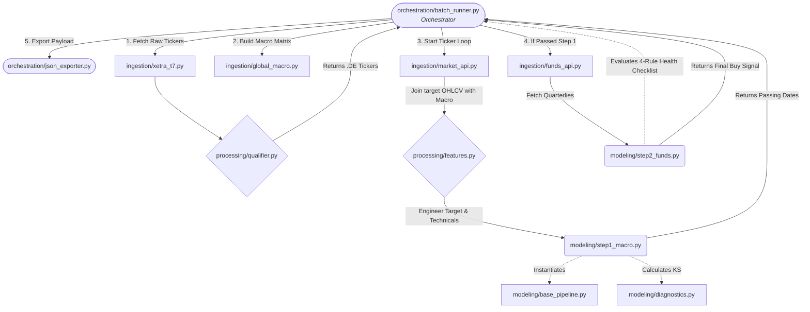

# Source Code Documentation (`src/`)

## Table of Contents
- [Module Interaction Flowchart](#module-interaction-flowchart)
- [1. `ingestion/`](#1-ingestion)
- [2. `processing/`](#2-processing)
- [3. `modeling/`](#3-modeling)
- [4. `orchestration/`](#4-orchestration)

This directory contains the entire codebase for the Xetra Two-Step Stock Prediction Engine. The architecture is modularized into four distinct layers: Ingestion, Processing, Modeling, and Orchestration. 

## Module Interaction Flowchart

Below is a precise breakdown of every folder and the specific responsibilities of each script.

---

## 1. `ingestion/`
Responsible for extracting data from external APIs (Yahoo Finance, FRED, Xetra) and performing quantitative data expansion.

* **`xetra_t7.py`**: Downloads and parses the Xetra T7 `allTradableInstruments.csv` directly from the Deutsche Börse network, extracting the raw universe of active securities.
* **`global_macro.py`**: Pre-fetches the entire 360-degree global macro universe (80+ series from FRED & Yahoo Finance). Crucially, this script executes a quantitative feature engineering block to create a stationary matrix of ~400+ features (e.g., interaction ratios, multi-timeframe momentums, regime Z-scores, acceleration derivatives). It caches this data to prevent IP bans.
* **`market_api.py`**: Fetches the daily historical OHLCV price data exclusively for the target stock being evaluated. It ensures dates align properly and then left-joins the target stock's data with the pre-cached global macro matrix from `global_macro.py`.
* **`funds_api.py`**: Fetches raw quarterly financial statements (Income Statement, Balance Sheet, Cash Flow) from Yahoo Finance. It drops duplicate or sparse rows and strictly filters the remaining data against the curated `FUNDAMENTAL_UNIVERSE` defined in the project configuration.

## 2. `processing/`
Responsible for transforming raw data structures, engineering target variables, and filtering criteria before data reaches the machine learning models.

* **`qualifier.py`**: Parses the raw Xetra dataframe to filter exclusively for active German retail stocks (identifiable by the `.DE` suffix). It guarantees the pipeline only attempts to predict liquid domestic equities.
* **`features.py`**: Engineers target-stock specific technical features (e.g. 21D/63D/126D/252D momentums, distance to 200-day SMA, 21D Volatility). Critically, it computes the future 6-month return for the target stock and uses the predefined thresholds to assign the binary `Target` variable (1 for UP, 0 for DOWN).

## 3. `modeling/`
Houses the Scikit-Learn machine learning architecture, validation algorithms, and step-execution wrappers.

* **`base_pipeline.py`**: Defines the Scikit-Learn pipeline architecture shared by both Step 1 and Step 2. It sequentially enforces Median Imputation, Z-Scaling (`StandardScaler`), ANOVA pre-filtering (`SelectKBest`), and iterative cross-validation via Sequential Feature Selection (`SFS`), ultimately wrapping a class-balanced Logistic Regression estimator.
* **`diagnostics.py`**: Calculates performance metrics. It dynamically calculates the optimal probability cutoff by maximizing the Kolmogorov-Smirnov (KS) statistic. It applies this cutoff to compute the true CV Accuracy and is capable of generating visual artifacts like Confusion Matrices and 10-Quantile Lift Charts.
* **`step1_macro.py`**: Wraps the `base_pipeline` for Step 1 ML execution. It passes the macro-matrix into the model, extracts exactly which features were killed by ANOVA vs. SFS, retrieves the standardized coefficients, and returns a filtered dataframe of only the dates where the model predicted an "UP" signal.
* **`step2_funds.py`**: Implements a deterministic Fundamental Rules Engine. Because Yahoo Finance historical fundamentals are sparse, this step bypasses ML and evaluates the most recent two quarters of financial statements against four hard rules (Revenue Growth, Profitability, Earnings Momentum, Cash Flow Health). It acts as the final gatekeeper, producing the final binary Buy/Reject signal.

## 4. `orchestration/`
The control center of the application that manages execution flow, memory, and artifact storage.

* **`batch_runner.py`**: The central nervous system of the engine. It calls `global_macro.py` once to pre-cache the universe, then loops over all qualified tickers using `tqdm`. It feeds data chronologically from `market_api` -> `features` -> `step1_macro` -> `funds_api` -> `step2_funds`. It aggregates all the outputs and orchestrates the cascade.
* **`json_exporter.py`**: Handles serializing and writing the complex model payload outputs to disk. It explicitly manages Numpy float/array type casting to ensure valid JSON files and separates outputs into two distinct streams: full prediction payloads (`outputs/predictions/`) and feature diagnostics (`outputs/diagnostics/`).
