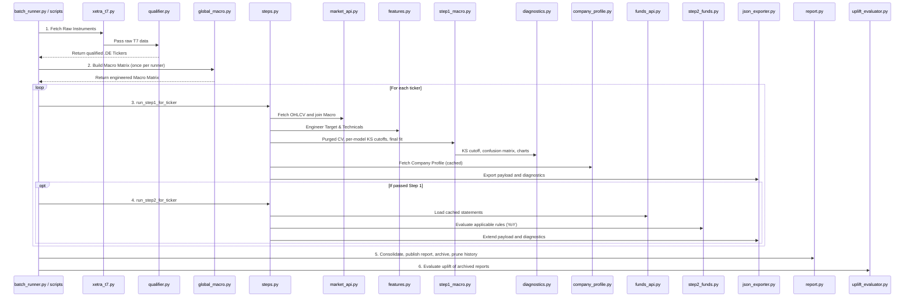

# Source Code Documentation (`src/`)

## Table of Contents
- [Runtime View](#runtime-view)
- [1. `ingestion/`](#1-ingestion)
- [2. `processing/`](#2-processing)
- [3. `modeling/`](#3-modeling)
- [4. `orchestration/`](#4-orchestration)

This directory contains the codebase of the Xetra Two-Step Stock Prediction Engine. The architecture is split into four layers: Ingestion, Processing, Modeling, and Orchestration. Parameters are read from `config/settings.yaml` through `config/settings.py`.

## Runtime View

The local CLI (`batch_runner.py`) and the GitHub Actions scripts (`scripts/02_run_step1.py`, `scripts/03_run_step2.py`, `scripts/04_consolidate.py`) use the same per-ticker runners in `steps.py` and the same consolidation in `report.py`.

```mermaid
sequenceDiagram
    participant BR as batch_runner.py / scripts
    participant T7 as xetra_t7.py
    participant QUAL as qualifier.py
    participant GM as global_macro.py
    participant ST as steps.py
    participant MA as market_api.py
    participant FEAT as features.py
    participant S1 as step1_macro.py
    participant DIAG as diagnostics.py
    participant CP as company_profile.py
    participant FA as funds_api.py
    participant S2 as step2_funds.py
    participant JE as json_exporter.py
    participant REP as report.py
    participant UP as uplift_evaluator.py

    BR->>T7: 1. Fetch Raw Instruments
    T7->>QUAL: Pass raw T7 data
    QUAL-->>BR: Return qualified .DE Tickers

    BR->>GM: 2. Build Macro Matrix (once per runner)
    GM-->>BR: Return engineered Macro Matrix

    loop For each ticker
        BR->>ST: 3. run_step1_for_ticker
        ST->>MA: Fetch OHLCV and join Macro
        ST->>FEAT: Engineer Target & Technicals
        ST->>S1: Purged CV, per-model KS cutoffs, final fit
        S1->>DIAG: KS cutoff, confusion matrix, charts
        ST->>CP: Fetch Company Profile (cached)
        ST->>JE: Export payload and diagnostics

        opt If passed Step 1
            BR->>ST: 4. run_step2_for_ticker
            ST->>FA: Load cached statements
            ST->>S2: Evaluate applicable rules (YoY)
            ST->>JE: Extend payload and diagnostics
        end
    end

    BR->>REP: 5. Consolidate, publish report, archive, prune history
    BR->>UP: 6. Evaluate uplift of archived reports
```

Below is a breakdown of every folder and the responsibilities of each script.

---

## 1. `ingestion/`
Responsible for extracting data from external APIs (Yahoo Finance, FRED, Xetra, Gemini) and the quantitative expansion of the macro data.

* **`xetra_t7.py`**: Downloads and parses the Xetra T7 `allTradableInstruments.csv` from the Deutsche Börse network, extracting the raw universe of tradable securities.
* **`global_macro.py`**: Fetches the macro universe (Yahoo Finance tickers and FRED series defined in `config/universe.py`). FRED series are fetched one by one, discontinued series are dropped, and every series is shifted by its publication lag. All series are forward-filled and aligned to business days, then expanded into roughly 400 stationary features (interaction ratios, multi-timeframe momentum, distance to the 200-day SMA, YoY acceleration, rolling 2-year Z-scores) by `engineer_macro_features()`.
* **`market_api.py`**: Fetches the daily OHLCV price data of the target stock and left-joins it with the pre-cached macro matrix.
* **`funds_api.py`**: Returns the financial statements of a ticker from the local cache (`data/raw/fundamentals/`), falling back to Yahoo Finance, filtered to the `FUNDAMENTAL_UNIVERSE`. It warns when the cache manifest shows that the cache is older than `fundamentals_max_age_days`.
* **`company_profile.py`**: Uses the Gemini 2.5 Flash API to generate a one-sentence description for a ticker. Results are cached in `data/processed/company_profiles_cache.json`, which the pipeline commits, so only new tickers are requested.

## 2. `processing/`
Responsible for qualifying the universe, engineering the target-stock features and evaluating past predictions.

* **`qualifier.py`**: Filters the raw Xetra dataframe to common stocks of the product groups `DEUTSCHLAND`, `DAX`, `MDAX` and `SDAX` and maps their mnemonics to Yahoo Finance `.DE` tickers. No liquidity filter is applied.
* **`features.py`**: Engineers target-stock technical features (21D/63D/126D/252D momentum, distance to the 50- and 200-day SMA, 21D volatility), computes the forward return over `horizon_days` and assigns the binary `Target` (1 if the return reaches `threshold`). It trims the warm-up history after the features are computed.
* **`uplift_evaluator.py`**: Backtests the archived reports closest to 1, 3 and 6 months ago by measuring each stock's return from the report date and averaging it per prediction cohort. Stocks priced at or below `min_price_eur` are excluded, as on the dashboard. Run with `uv run python -m src.processing.uplift_evaluator`.

## 3. `modeling/`
Houses the Scikit-Learn machine learning architecture, validation algorithms, and the fundamental ruleset.

* **`base_pipeline.py`**: Defines the Scikit-Learn pipeline (median imputation, variance threshold, Z-scaling, ANOVA pre-filter, Sequential Feature Selection, class-balanced Logistic Regression) and `purged_time_series_cv()`, which builds expanding-window splits with a gap of `horizon_days` rows between training and test data.
* **`diagnostics.py`**: Calculates the KS statistic and cutoff, rejects degenerate cutoffs, classifies a model's predictions with the KS cutoff learned on the same model's training rows, and saves confusion matrix and lift charts (Agg backend).
* **`step1_macro.py`**: Executes Step 1: validates the model with purged cross-validation, classifying each fold model with its own training-data KS cutoff, rejects tickers that cannot be validated with a `cv_status`, fits the final model, extracts the selected features and weights, and applies the CV accuracy gate, the confusion matrix rule and the final model's KS cutoff to the latest prediction.
* **`step2_funds.py`**: Implements the deterministic Fundamental Rules Engine. It compares the latest statement with the same period one year earlier (falling back to the previous statement), skips rules whose inputs are not reported, and passes companies that meet the pro-rated `min_step2_score` on at least `min_step2_applicable_rules` applicable rules.

## 4. `orchestration/`
The control layer that manages execution flow and artifact storage.

* **`steps.py`**: `run_step1_for_ticker()` and `run_step2_for_ticker()`, shared by the local CLI and the GitHub Actions scripts. Step 2 extends the Step 1 payload and diagnostics instead of replacing them.
* **`report.py`**: Consolidates the shard outputs into one payload per ticker, writes `full_batch_report.json` and `final_buy_signals.csv`, archives the report, prunes the history by report date and updates the company profile cache.
* **`batch_runner.py`**: The local CLI flow. It qualifies the tickers, fetches the macro matrix once, runs both steps per ticker sequentially and publishes the report with `report.py`.
* **`json_exporter.py`**: Serializes payloads and diagnostics. It converts numpy types and non-finite floats (to `null`) and replaces files atomically, so a failed write never truncates an existing file.
* **`logging_setup.py`**: Configures logging for the CLI and the scripts.
